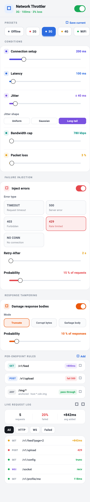

# flutter_network_throttler

Simulate slow, unreliable, or failing network conditions in your Flutter app so
you can **test loading spinners, timeouts, retries, and error states** — in
widget/integration tests *and* by hand — without depending on a real flaky
server.

Route your real HTTP/dio/WebSocket traffic through a throttling adapter, drive it
deterministically from tests with a `seed`, and tune everything live from a
drop-in debug **control panel**.

[](https://pub.dev/packages/flutter_network_throttler)
[](https://github.com/firaskola/flutter_network_throttler/actions/workflows/ci.yaml)
[](https://codecov.io/gh/firaskola/flutter_network_throttler)
[](LICENSE)

<p align="center">
  
</p>

## Features

- 🐢 **Conditions** — connection-setup (DNS/TLS) delay, latency, jitter,
  bandwidth cap, and packet loss.
- 🎲 **Latency distributions** — `uniform`, `gaussian`, or `long-tail` jitter to
  mimic real-world tail latency.
- 📱 **Presets** — `Offline`, `2G`, `3G`, `4G`, `WiFi`, plus **saved custom presets**.
- 💥 **Failure injection** — fail a configurable fraction of requests with a
  `timeout`, `500`, `403`, **`429` (with `Retry-After`)**, or `no-connection`.
- 🧪 **Response tampering** — truncate, corrupt, or replace a fraction of
  successful response bodies to test parser robustness.
- 🎯 **Per-endpoint rules** — match by method, path/URL glob, **host, query, and
  headers**, with optional **anchoring** — slow it, fail it, or pass it through.
- 📡 **Live request log** — captured with outcome, timing, metrics, filters,
  pause/clear, and tap-to-inspect.
- 🔌 **Real traffic** — a `package:http` client wrapper (**streaming**, with
  bandwidth applied progressively), a `package:dio` interceptor, a
  `WebSocketChannel` wrapper, **and** a generic `Stream` transformer share one
  engine.
- 🎛️ **Control panel** — `NetworkThrottlerPanel`, a debug UI to drive it all.
- 💾 **Persistence** — save/restore configuration via any store you plug in.
- 🎬 **Scenario scripting** — script timed conditions ("offline for 5s, then 3G").
- 🛠️ **DevTools** — drive it from Flutter DevTools via service extensions.
- 🚦 **Toggleable & deterministic** — flip `enabled` at runtime; pass a `seed`
  for repeatable tests.

## Getting started

```yaml
dependencies:
  flutter_network_throttler: ^1.0.0
```

Everything is driven by a single `ThrottleController`:

```dart
import 'package:flutter_network_throttler/flutter_network_throttler.dart';

final controller = ThrottleController();
```

## Testing (the main event)

The control panel is great for poking at your app by hand — but the real payoff
is **deterministic tests** of your loading, timeout, retry, and error states.
Pass a `seed` so every jitter draw and failure roll is repeatable, point your
UI at a `ThrottleClient`, and assert on what the user sees.

```dart
testWidgets('shows a retry button when the feed request fails', (tester) async {
  // p=1.0 + seed => this request always fails, identically, every run.
  final controller = ThrottleController(
    profile: const ThrottleProfile(
      condition: NetworkCondition.perfect,
      failure: FailureInjection(
        enabled: true,
        type: FailureType.http500,
        probability: 1.0,
      ),
    ),
    seed: 42,
  );
  final client = ThrottleClient(yourBackendOrMock, controller: controller);

  await tester.pumpWidget(MyFeedScreen(client: client));
  await tester.pumpAndSettle();

  expect(find.text('Something went wrong'), findsOneWidget);
  expect(find.text('Retry'), findsOneWidget);
});
```

Other handy testing recipes:

- **Slow network → loading spinner.** Apply `NetworkCondition.twoG` (or a custom
  latency) and assert the spinner is on screen before `pumpAndSettle`.
- **Rate limiting.** Use `FailureType.http429`; the synthesized response carries
  a `Retry-After` header so you can test your back-off.
- **Malformed payloads.** Turn on `ResponseTampering` (truncate / corrupt /
  garbage) and assert your parser fails gracefully.
- **Flaky timelines.** Drive a `ThrottleScenario` ("offline for 5s, then 3G")
  with `package:fake_async` for fast, deterministic integration tests.
- **No HTTP?** Wrap any `Future` with `NetworkThrottler(seed: ...)`.

Because `ThrottleClient` is a normal `http.Client` and `ThrottleInterceptor` a
normal dio `Interceptor`, they drop into whatever you already inject in tests.

## Throttle real HTTP traffic

### package:http

```dart
import 'package:http/http.dart' as http;

final client = ThrottleClient(http.Client(), controller: controller);

// Now behaves according to the controller's profile, and is logged.
final response = await client.get(Uri.parse('https://api.example.com/v1/feed'));
```

`ThrottleClient` **streams** the response body through, applying the bandwidth
cap progressively per chunk instead of buffering the whole payload in memory —
so large downloads don't blow up memory and download progress reaches your UI as
it arrives. Pass `streamResponses: false` to buffer instead (responses are also
buffered automatically when response tampering applies to a request).

### package:dio

```dart
import 'package:dio/dio.dart';
import 'package:flutter_network_throttler/dio.dart';

final dio = Dio()..interceptors.add(ThrottleInterceptor(controller));
```

### WebSockets

Wrap a `WebSocketChannel` to throttle the handshake and every frame. The same
conditions apply: latency/jitter delay each frame, the bandwidth cap slows large
frames, packet loss drops individual frames, and failure injection (or an
offline condition) fails the connection. Frames show up in the same live log,
tagged `WS`, `WS↑` (sent), and `WS↓` (received).

```dart
import 'package:flutter_network_throttler/web_socket.dart';

// One-liner: connect and throttle in a single call.
final socket = ThrottleWebSocketChannel.connect(
  Uri.parse('wss://example.com/socket'),
  controller: controller,
);

socket.stream.listen(handleMessage);
socket.sink.add('ping');
```

Already have a channel? Wrap it instead:

```dart
import 'package:web_socket_channel/web_socket_channel.dart';

final raw = WebSocketChannel.connect(Uri.parse('wss://example.com/socket'));
final socket = ThrottleWebSocketChannel(raw, controller: controller);
```

## The control panel

`NetworkThrottlerPanel` is just the **content** (no app bar) so you can present
it however you like. Three ready-made ways:

```dart
// 1. Bottom sheet — dismiss by dragging the handle down or tapping the scrim.
showNetworkThrottlerPanel(context, controller);

// 2. Full-screen page — gets a standard back button to pop it.
showNetworkThrottlerPage(context, controller);
// (or push NetworkThrottlerPage(controller: controller) yourself)

// 3. Embedded — drop the panel into any layout (tab, drawer, split view).
Expanded(child: NetworkThrottlerPanel(controller: controller));
```

> **Pushing the bare `NetworkThrottlerPanel` as a route won't give you a back
> button** — it has no `Scaffold`/app bar by design. Use `NetworkThrottlerPage`
> (or wrap the panel in your own `Scaffold` + `AppBar`) for a page with a back
> button.

The `NetworkThrottlerButton` launcher can open either form:

```dart
NetworkThrottlerButton(
  controller: controller,
  presentation: ThrottlerPresentation.page, // default is .sheet
)
```

The panel exposes the master switch, preset chips, condition sliders, failure
injection, per-endpoint rules, and the live request log — all bound to the same
controller your client reads from.

### How users open it (debug-only)

You don't ship the panel to real users — you expose a trigger that only exists
in debug builds. `NetworkThrottlerButton` does exactly that: it renders **only
when `kDebugMode` is true** and opens the panel as a modal sheet.

**Floating button over any screen** — drop it into a `Scaffold`:

```dart
Scaffold(
  floatingActionButton: NetworkThrottlerButton(controller: controller),
  body: MyHomePage(),
)
```

**A row in your Settings screen** — pass your own trigger as `child`:

```dart
NetworkThrottlerButton(
  controller: controller,
  child: const ListTile(
    leading: Icon(Icons.network_check),
    title: Text('Network throttler'),
    subtitle: Text('Simulate slow / failing network'),
    trailing: Icon(Icons.chevron_right),
  ),
)
```

**Or wire it yourself** — gate any widget with `kDebugMode` and call the helper:

```dart
if (kDebugMode)
  IconButton(
    icon: const Icon(Icons.network_check),
    onPressed: () => showNetworkThrottlerPanel(context, controller),
  ),
```

In release builds `NetworkThrottlerButton` returns an empty widget, so there's
nothing to strip out.

### Enabling it in release builds (for testers)

Sometimes you need the throttler in a **release/profile** build — QA on a real
device, a TestFlight/internal track, reproducing a field issue. Set
`showInReleaseMode: true` to allow it.

To keep it out of *production* while still letting testers flip it on, gate that
flag behind a build-time `--dart-define`, so only builds compiled with the flag
expose it:

```dart
// Only true when the build was compiled with the flag below.
const kThrottlerEnabled = bool.fromEnvironment('ENABLE_NET_THROTTLER');

NetworkThrottlerButton(
  controller: controller,
  showInReleaseMode: kThrottlerEnabled,
)
```

Build a tester version with it on, and a normal store build with it off:

```bash
# Testers get the throttler:
flutter build apk --release --dart-define=ENABLE_NET_THROTTLER=true

# Production build — flag absent, button never renders:
flutter build apk --release
```

In debug builds the button always shows regardless of the flag, so day-to-day
development is unaffected.

## Configure in code

```dart
// Apply a preset…
controller.applyPreset(NetworkCondition.threeG);

// …or tune individual conditions.
controller
  ..setConnectionSetup(const Duration(milliseconds: 200)) // DNS/TLS handshake
  ..setLatency(const Duration(milliseconds: 200))
  ..setJitter(const Duration(milliseconds: 80))
  ..setDistribution(LatencyDistribution.longTail) // uniform | gaussian | longTail
  ..setBandwidth(780)   // kbps
  ..setPacketLoss(0.1); // 10%

// Inject failures, including 429 with a Retry-After header.
controller
  ..toggleFailure()
  ..setFailureType(FailureType.http429)
  ..setRetryAfter(const Duration(seconds: 5))
  ..setFailureProbability(0.25);

// Damage a fraction of response bodies to test parser robustness.
controller
  ..toggleTampering()
  ..setTamperMode(TamperMode.corrupt) // truncate | corrupt | garbage
  ..setTamperProbability(0.1);
```

### Per-endpoint rules

Rules are evaluated in order (first match wins). Match on method + a path/URL
glob, and optionally narrow by **host**, **query**, **headers**, or require the
pattern to match the whole URL with **`anchored`**:

```dart
// Slow one endpoint.
controller.addRule(const EndpointRule(
  method: 'GET',
  pattern: '/v1/feed',
  action: DelayAction(Duration(milliseconds: 800)),
));

// Let CDN images through, matched by host.
controller.addRule(const EndpointRule(
  pattern: '/img/*',
  host: '*.cdn.example.com',
  action: PassThroughAction(),
));

// Fail only authenticated, paged search requests.
controller.addRule(const EndpointRule(
  pattern: '/search',
  anchored: true,                       // exact path, not a substring
  query: {'page': '*'},
  headers: {'authorization': 'Bearer *'},
  action: FailAction(FailureType.http403),
));
```

> By default a pattern matches as a **substring** (`/v1/feed` also matches
> `/api/v1/feed/extra`). Set `anchored: true` to require an end-to-end match.
> Header matching needs the adapter to forward request headers — the bundled
> `http` and `dio` adapters do this for you.

## Generic streams (gRPC, SSE, event buses)

Throttle any `Stream` with `ThrottleStreamTransformer` — latency delays each
event, the bandwidth cap slows large events, packet loss drops events, and an
injected connection failure errors the stream:

```dart
final throttled = source.transform(
  ThrottleStreamTransformer<MyEvent>(
    controller,
    label: 'grpc:Updates',
    byteSizeOf: (e) => e.estimatedBytes,
  ),
);
```

## Persistence

The package depends on no storage plugin — implement `ThrottleStorage` (or use
`CallbackThrottleStorage`) against `shared_preferences`, `hive`, a file, etc.,
and the controller restores on startup and saves on every change:

```dart
final controller = ThrottleController(
  storage: CallbackThrottleStorage(
    read: () async => prefs.getString('throttler'),
    write: (data) => prefs.setString('throttler', data),
  ),
);
await controller.loaded; // optional: wait for restore before building UI
```

Every model is JSON-serialisable (`toJson` / `fromJson`) if you prefer to manage
state yourself.

## Scenario scripting

Script a timeline of conditions to reproduce flaky-network bugs or drive
integration tests deterministically:

```dart
final scenario = ThrottleScenario.offlineFor(
  const Duration(seconds: 5),
  recover: NetworkCondition.threeG,
)..start(controller);

// …or build your own steps:
ThrottleScenario([
  ScenarioStep(Duration.zero, (c) => c.applyPreset(NetworkCondition.twoG)),
  ScenarioStep(const Duration(seconds: 3),
      (c) => c.setPacketLoss(0.5)),
], loop: true).start(controller);
```

## DevTools

Drive the throttler from Flutter DevTools (or any VM-service client) without
on-screen UI — registers no-op in release builds:

```dart
registerThrottleServiceExtensions(controller);
// ext.flutter_network_throttler.enable / preset / failure / clearLog / state
```

## Without HTTP

Need to throttle an arbitrary `Future` (a repository call, a mock data source)?
Use the standalone `NetworkThrottler`:

```dart
final throttler = NetworkThrottler(condition: NetworkCondition.threeG, seed: 42);

final value = await throttler.throttle(
  () => repository.fetchProfile(),
  responseBytes: 20 * 1024,
);
```

It throws `SimulatedNetworkException` when a request is dropped.

See the [`example/`](example/) app for the panel wired to a demo client.

## Providing the controller

`ThrottleController` is a `ChangeNotifier`, so it slots into whatever you already
use. For plain Flutter, there's a built-in `InheritedNotifier`:

```dart
NetworkThrottlerScope(
  controller: controller,
  child: MyApp(),
);

// Anywhere below:
final controller = NetworkThrottlerScope.of(context);
```

Using a state-management package? Drop it straight in:

- **provider** — `ChangeNotifierProvider.value(value: controller)`
- **Riverpod** — expose it from a `ChangeNotifierProvider` / `Provider`
- **Bloc** — hold it in a cubit, or `RepositoryProvider.value(value: controller)`

No extra dependency is added by this package for any of these.

## Additional information

- **Issues & feature requests:** the
  [issue tracker](https://github.com/firaskola/flutter_network_throttler/issues).
- **Contributing:** see [CONTRIBUTING.md](CONTRIBUTING.md).
- **License:** [MIT](LICENSE).
